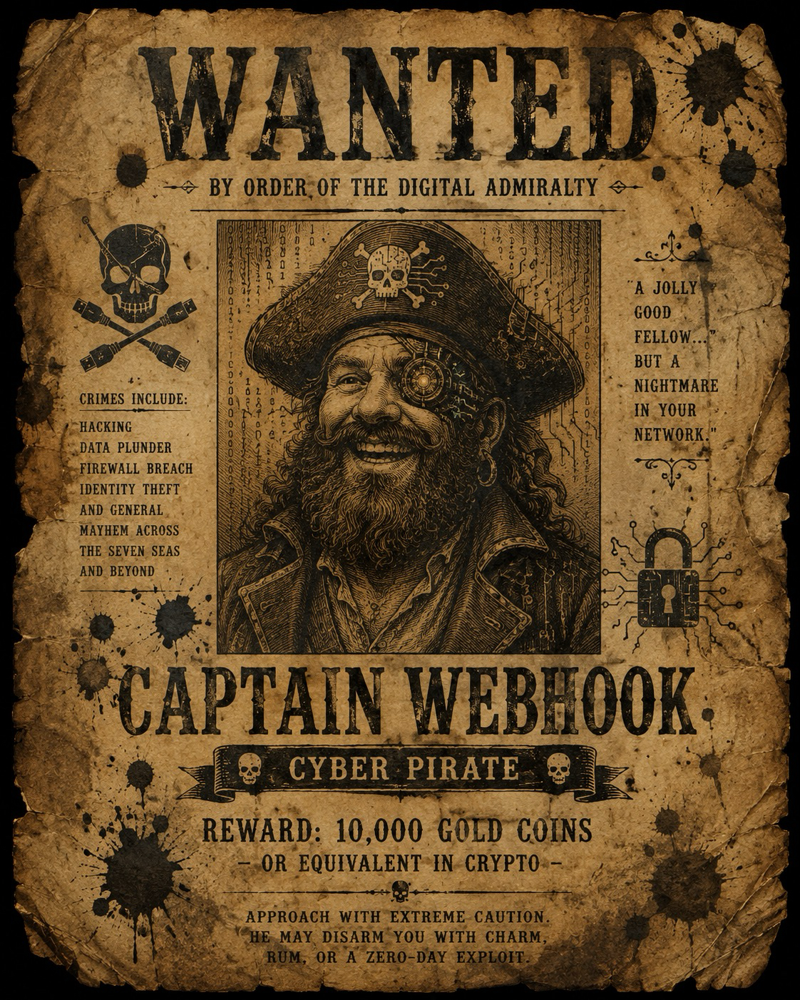

# ☠ WANTED ☠



## CAPTAIN WEBHOOK
### cyber-pirate — bounty: classified — last seen: force-pushing into the sunset

---

If you're reading this, the corpo police finally caught up with me. Not with cutlasses,
mind you — with a compliance audit. My rig ran **Windows 10** clean out of updates the same
week they raided the port, and when the box finally keeled over, so did my last excuse to
stay online.

But before they dragged me off, I did what any self-respecting pirate does with a treasure
too big to carry: I buried it, and I split the map.

**The second-largest treasure in these waters is hidden within ten meters of wherever
you're reading this.** The key to it does not exist as a single object. I broke it into
two unrelated logs — no shared port of origin, no common ancestor between them. Mine,
worked loose thread by loose thread, resolves into half a **Log Pose reading**. The Pose
only points true when both halves are read together.

The other half isn't just "out there" — my first mate, **Ms. Inga Semicolon**, made her
move during the mutiny. She copied this log clean off the board the moment she turned on
me, before I even noticed she was gone. Didn't get far enough, or fast enough — the corpo
police busted me anyway, mutiny or no mutiny. Fair's fair, though: wherever she ran to,
she's still holding her half of the key. Find her repository. It'll look, to any
harbourmaster running `git log`, like it forked clean off of mine. That's no accident —
it did. Compare charts with her crew. You'll need to.

## The Trials

Each log is knotted the same four ways per crew. To clear a knot you'll need, in whatever
order you find them:

- A **rebase** — the compass bearing I buried was recorded, then the record moved. Find
  where it moved to.
- A **cherry-pick** — a trick I logged on a page that never made it into the main journal.
  Go get it.
- A **conflict** — two hands wrote over the same line. Only one telling is true. You
  decide which, by hand.
- A **stashed manifest** (git-lfs) — cargo I promised is listed on the manifest, but the
  receipt and the hold don't agree. Chase it down.

Four trials, one crew per log-half. Two crews on my log. Two crews on Ms. Semicolon's.
One Pose.

## Setting Sail

Two crews work my log, each on their own branch:

- **the cipher crew** — checkout `cpt-webhook/cipher-crew/work`
- **the seal crew** — checkout `cpt-webhook/seal-crew/work`

Clone this repository, then check out your crew's branch:

```
git clone <this-repo-url>
cd <this-repo>
git lfs install --local --skip-smudge
git checkout cpt-webhook/cipher-crew/work    # or cpt-webhook/seal-crew/work
```

That `git lfs install --skip-smudge` line matters — without it, git tries to fetch
every stashed manifest the moment you check out a branch, and stops with a scary
download error on the ones the quartermaster hasn't handed over yet. With it, a
missing manifest just looks like a plain page of text (a pointer, not the cargo) —
which is exactly the state you're meant to find it in.

First thing to do once you're on your branch: get your bearings.

```
git log --all --oneline --graph
git branch -a
git tag -l
```

That'll show you every branch and tag in this log, including the ones you don't
own yet — the fixes, the scratch pages, and the joined log (`cpt-webhook/integration`)
where both crews' work eventually comes together. Your branch is stuck for a reason.
Start digging.

## Winning

Once your crew's log resolves clean, run the script it produces:

```
python3 src/part_a.py
```

It will print half a Log Pose reading — two digits. Find Ms. Semicolon's crew, find
their half, put both readings together **my reading first, hers second** and you'll
have your four digits.

Whatever's locked up within ten meters of you — that's what opens it.

Fair winds, and mind the conflict markers.

— *C.W.*
